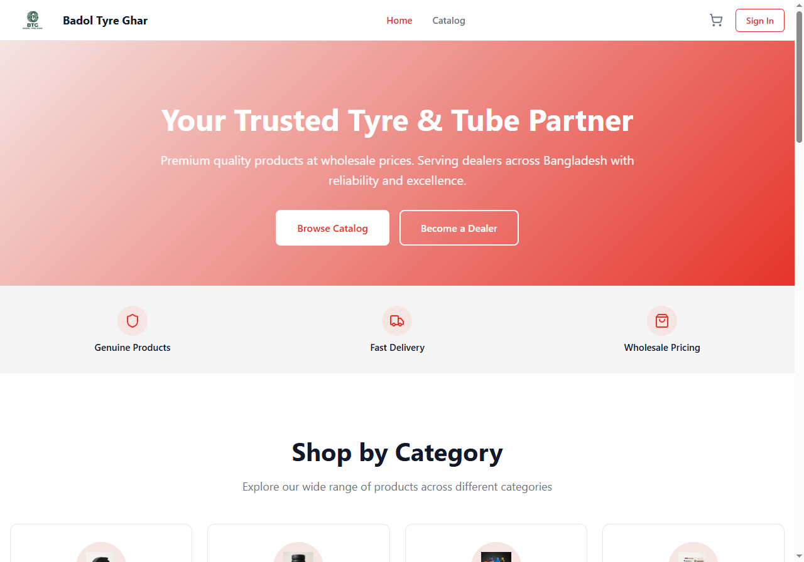
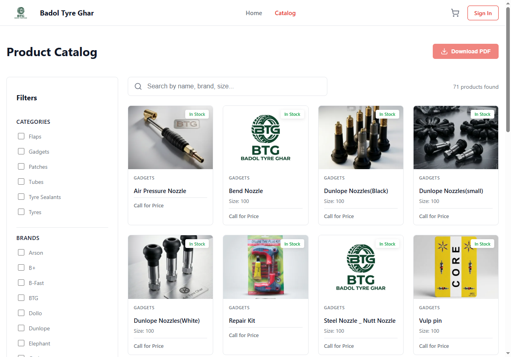
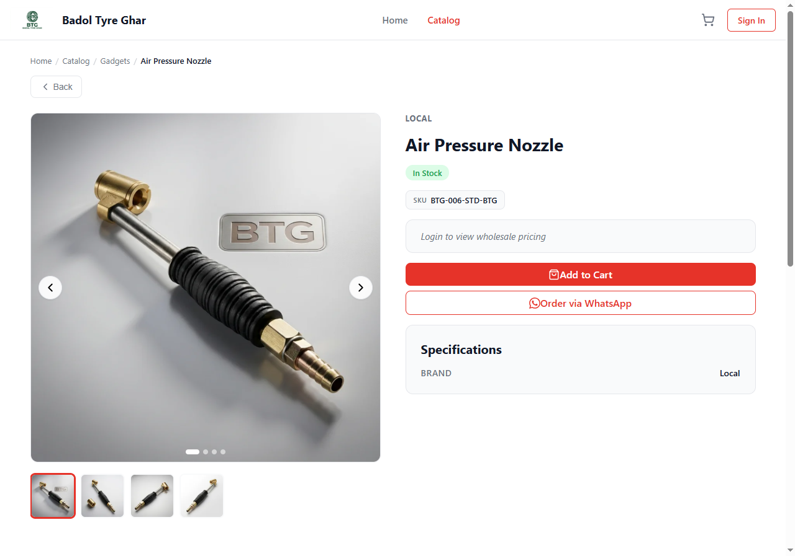
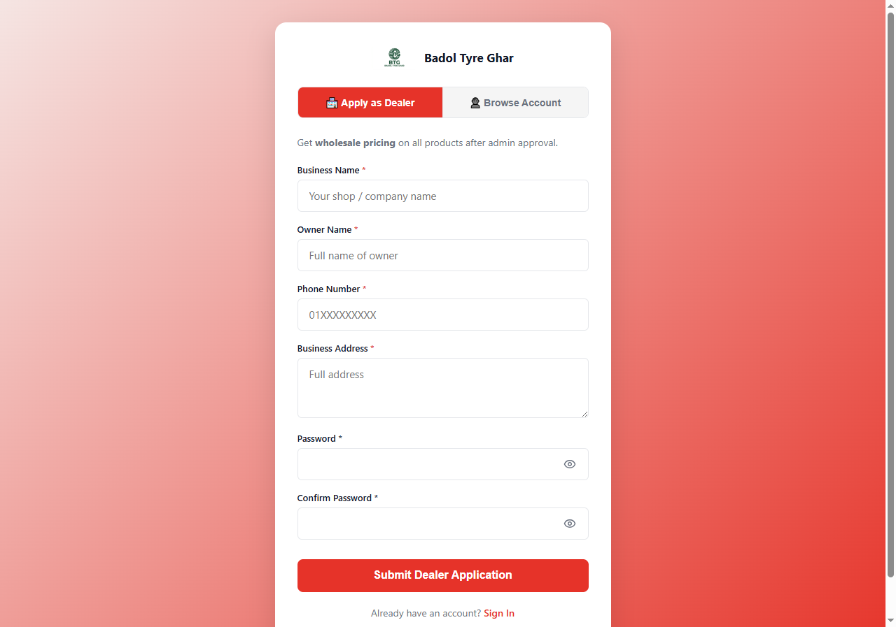

<div align="center">


# Badol Tyre Ghar v4

**B2B wholesale tyre dealer management platform — built for Bangladesh**

[](https://nodejs.org)
[](https://expressjs.com)
[](https://mongodb.com/atlas)
[](https://react.dev)
[](https://vitejs.dev)
[](https://badol-tyre-ghar.vercel.app)
[](https://badol-tyre-ghar-v4-production.up.railway.app/api/v1/health)
[](#license)

**[🌐 Live Demo](https://badol-tyre-ghar.vercel.app)** · **[⚡ API Health](https://badol-tyre-ghar-v4-production.up.railway.app/api/v1/health)** · **[📖 API Reference](backend/API_ROUTES_REFERENCE.md)** · **[🚀 Get Started](#getting-started)**

</div>

---



---

## What is this?

Badol Tyre Ghar v4 is a production-grade B2B platform for a Bangladeshi tyre wholesale distributor. It solves a specific business problem: **prices are confidential unless you're an approved dealer**.

Public visitors browse the full product catalog — categories, brands, search, pagination, product detail pages with image galleries. No prices anywhere.

Once a dealer registers and an admin approves their account, the experience changes. The same catalog now shows wholesale prices, automatically adjusted for their tier, active campaigns, and any per-dealer discount. All pricing is computed server-side — the frontend only displays what the backend sends.

Dealers add items to an inquiry cart and submit it — generating a structured WhatsApp message pre-filled with product names, SKUs, and quantities. That's the B2B flow: browse → inquire → WhatsApp negotiation → order.

---

## Screenshots

<table>
  <tr>
    <td><b>Product Catalog</b></td>
    <td><b>Product Detail</b></td>
  </tr>
  <tr>
    <td></td>
    <td></td>
  </tr>
  <tr>
    <td><b>Dealer Registration</b></td>
    <td><b>Homepage</b></td>
  </tr>
  <tr>
    <td></td>
    <td></td>
  </tr>
</table>

---

## Table of Contents

- [Key Features](#key-features)
- [Tech Stack](#tech-stack)
- [Architecture](#architecture)
- [Pricing Engine](#pricing-engine)
- [Security Model](#security-model)
- [Project Structure](#project-structure)
- [Getting Started](#getting-started)
- [Environment Variables](#environment-variables)
- [API Overview](#api-overview)
- [Testing](#testing)
- [Deployment](#deployment)

---

## Key Features

### Public visitors
- Product catalog with category, brand, and full-text search filters
- Paginated results, mobile-first responsive layout
- Product detail pages with image gallery, variant selector, and specs
- Prices hidden from all unauthenticated visitors

### Approved dealers
- Wholesale pricing with tier discounts — Standard (0%), Silver (5%), Gold (10%), Platinum (15%)
- Per-dealer extra discount multiplier set individually by admin
- Campaign discounts — percent or flat, scoped by product, category, or brand
- Inquiry cart → auto-generated WhatsApp purchase message
- PDF catalog download by category or full catalog
- Order history and account stats on profile page

### Admin panel
- Dashboard with KPI cards and charts — products by brand, dealer registrations over time
- Dealer registration approvals with pending / approved / rejected workflow and tier management
- Full product catalog CRUD — visibility toggle, per-variant stock updates
- Bulk CSV product import and bulk price markup tools
- Search analytics — see exactly what dealers are searching for
- Campaign management — create, edit, activate / deactivate, delete
- Media library with Cloudinary upload and delete
- Notification center
- Order management — status tracking, payment tracking, invoice PDF download
- Site configuration — maintenance mode, announcement banner, WhatsApp number
- **View As Dealer** — admins can preview catalog pricing as any specific dealer

---

## Tech Stack

| Layer | Technology |
|---|---|
| Backend runtime | Node.js LTS, CommonJS |
| Backend framework | Express v5 |
| Database | MongoDB Atlas, Mongoose v9 |
| Auth | JWT (15 min access) + httpOnly refresh cookie (30 days) + bcrypt 12 rounds + PASSWORD_PEPPER |
| Frontend framework | React v19, Vite v6 |
| Frontend routing | React Router v7 |
| Styling | CSS Modules — no global class names, all tokens in `variables.css` |
| Charts | Recharts |
| Icons | Lucide React |
| PDF generation | @react-pdf/renderer |
| Media storage | Cloudinary — max 5 MB, JPEG / PNG / WebP |
| Backend testing | Jest + Supertest + fast-check (property-based) |
| Frontend testing | Vitest + @testing-library/react |
| Deployment | Vercel (frontend) + Railway (backend) |

---

## Architecture

BTG v4 is a **modular monolith** — one deployable backend with clean internal module boundaries. Each module owns its model, service, controller, and routes. Modules communicate via service imports only. No module reaches into another module's database layer directly.

```
Browser
  │  HTTPS
  ▼
Vercel  ─────────────  React SPA (static, CDN-distributed)
  │  HTTPS API calls
  ▼
Railway  ────────────  Express API (Node.js, always-on)
  │  Connection string
  ▼
MongoDB Atlas  ──────  Primary data store
  │  Media operations
  ▼
Cloudinary  ─────────  Image storage and transformation
```

### Backend modules

| Module | Responsibility |
|---|---|
| `auth` | Registration, login, JWT issuance, refresh token rotation, token theft detection |
| `catalog` | Products, categories, brands, campaigns, search, search analytics |
| `orders` | Inquiry conversion to orders, order status, payment tracking, invoice PDF |
| `media` | Cloudinary upload / delete, media asset management |
| `notifications` | Admin notification creation and read state |
| `siteConfig` | Site-wide settings, maintenance mode, announcement banner |
| `users` | Dealer management, approval workflow, tier assignment, analytics |

### Request lifecycle

```
HTTP Request
    ↓
Route         url mapping + middleware chain (no business logic)
    ↓
Controller    HTTP parsing + response formatting (no business logic)
    ↓
Service       all business logic lives here
    ↓
Model         data access only
    ↓
MongoDB Atlas
```

### Authentication flow

1. Login returns an `accessToken` in the response body — 15 min expiry
2. A `btg_refresh` httpOnly cookie is set alongside it — 30 days
3. The frontend stores the access token in memory only — never `localStorage`
4. On 401, the frontend automatically calls `POST /auth/refresh` — the cookie is sent by the browser
5. A new access token is issued and the old refresh token is rotated
6. If a **revoked** token is reused → all sessions for that user are immediately revoked (token theft detection)
7. Only the SHA-256 hash of the refresh token is stored in the database

### Frontend data flow

```
AuthContext  →  bootstraps on mount, restores session from cookie
    ↓  waits for bootstrap to complete (race condition prevention)
Page component  →  lazy loaded
    ↓
useFetch(path, ready: !authLoading)
    ↓
api service  →  injects Bearer token, handles 401 refresh automatically
    ↓
Backend
```

---

## Pricing Engine

Pricing is 100% server-side. The frontend receives a computed `tierPrice` per variant and displays it — it never derives, adjusts, or interpolates prices.

Stack applied in order:

1. **Base price** — `wholesalePrice` for approved dealers, admins, editors; `retailPrice` for everyone else
2. **Dealer multiplier** — per-dealer extra discount (%) set by admin, defaults to 0
3. **Tier discount** — Standard 0%, Silver 5%, Gold 10%, Platinum 15% (configurable via `TierPricingRule` model)
4. **Campaign discount** — best matching active campaign by product, category, or brand; percent or flat
5. **Round** to 2 decimal places, clamp to ≥ 0

Active campaigns and tier rules are cached in-memory with a 60-second TTL to avoid hitting the database on every catalog request.

---

## Security Model

| Concern | Implementation |
|---|---|
| Query timeout | Every Mongoose query has `.maxTimeMS(5000)` — prevents slow query DoS |
| Refresh token storage | SHA-256 hash stored in DB; raw value in httpOnly cookie only |
| Token theft detection | Revoked token reuse → all sessions for that user revoked immediately |
| Password hashing | bcrypt, 12 rounds + `PASSWORD_PEPPER` prepended before hashing |
| Rate limiting | Login: 10 req / 15 min per IP — Register: 5 req / 60 min per IP |
| Auth order | `protect` always runs before `restrictTo` — never reversed |
| Soft delete | No hard deletes anywhere in the system — `isDeleted: true` only |
| Audit logging | Every admin POST / PATCH / DELETE writes to `AuditLog` — fire-and-forget |
| Input validation | 1 MB request body limit; 5 MB file limit; JPEG / PNG / WebP only |
| CORS | Explicit allowed origins; `credentials: true`; no wildcard |
| Data exposure | `password` field has `select: false`; JWT payload contains only `{ userId, role, registrationStatus, tier }` — no PII |

---

## Project Structure

```
btg-v4/
├── backend/
│   ├── src/
│   │   ├── app.js                    # Express app, middleware, CORS, route mounting
│   │   ├── config/db.js              # MongoDB Atlas connection
│   │   ├── middleware/
│   │   │   ├── auth.js               # protect, restrictTo, optionalAuth
│   │   │   ├── rateLimiter.js        # loginLimiter, registerLimiter
│   │   │   └── activityLogger.js     # audit log middleware
│   │   ├── modules/
│   │   │   ├── auth/                 # service, controller, routes, RefreshToken.model
│   │   │   ├── catalog/              # Product, Category, Brand, Campaign, Inquiry, SearchLog
│   │   │   ├── media/                # Cloudinary integration, MediaAsset.model
│   │   │   ├── notifications/        # Notification.model, service, controller
│   │   │   ├── orders/               # Order.model, service, controller, routes
│   │   │   ├── siteConfig/           # SiteConfig.model (singleton), service, controller
│   │   │   └── users/                # User.model, dealer management, analytics
│   │   ├── routes/
│   │   │   ├── index.js              # Public route aggregator
│   │   │   └── admin.js              # Admin route aggregator (protect applied once for all)
│   │   └── utils/
│   │       ├── pricingService.js     # Entire pricing engine
│   │       ├── tierPricingService.js # Tier discount resolution with DB fallback
│   │       ├── sendResponse.js       # Consistent API response envelope
│   │       ├── validators.js         # Input validation + NoSQL injection prevention
│   │       └── auditLogger.js        # Audit log writer
│   ├── tests/
│   │   ├── integration/              # Supertest route tests
│   │   ├── unit/                     # Jest service / utility tests
│   │   └── properties/               # fast-check property-based tests
│   ├── index.js                      # Server entry point (http.createServer + listen)
│   └── .env.example                  # All required variables with placeholder values
│
├── frontend/
│   └── src/
│       ├── components/
│       │   ├── layout/               # Navbar, Footer, AdminLayout, AnnouncementBanner
│       │   ├── ui/                   # Button, Badge, Modal, Spinner, Pagination, etc.
│       │   ├── catalog/              # ProductCard, ProductGrid, FilterSidebar
│       │   └── pdf/                  # CatalogDocument, InvoiceDocument
│       ├── context/
│       │   ├── AuthContext.jsx       # Auth state, bootstrap, login, logout, refreshUser
│       │   ├── CartContext.jsx       # Inquiry cart — persisted to localStorage
│       │   └── ViewAsContext.jsx     # Admin "preview as dealer" state
│       ├── hooks/
│       │   ├── useFetch.js           # Authenticated GET hook with auth-ready guard
│       │   └── usePdfDownload.jsx    # PDF generation and download hook
│       ├── pages/
│       │   ├── public/               # Home, Catalog, ProductDetail, Cart
│       │   ├── auth/                 # Login, Register (customer + dealer flows)
│       │   ├── dealer/               # Profile with order history and tier info
│       │   └── admin/                # Dashboard, AdminCatalog, Registrations, etc.
│       ├── services/api.js           # fetch wrapper — token injection + auto-refresh on 401
│       ├── styles/
│       │   ├── variables.css         # All design tokens (colors, spacing, radius, fonts)
│       │   └── global.css            # Base reset only
│       └── utils/
│           ├── formatters.js         # Price (৳), date, number formatters
│           ├── validators.js         # Frontend input validation
│           ├── constants.js          # App-wide constants
│           └── imageUtils.js         # Cloudinary URL transform helpers
│
├── api/index.js                      # Vercel serverless entry point
└── docs/screenshots/                 # App screenshots for README
```

---

## Getting Started

### Prerequisites

- Node.js LTS
- A [MongoDB Atlas](https://mongodb.com/atlas) cluster (free tier works)
- A [Cloudinary](https://cloudinary.com) account (free tier works)

### Clone and install

```bash
git clone https://github.com/neloy559/badol-tyre-ghar-v4.git
cd btg-v4
```

**Backend:**

```bash
cd backend
npm install
cp .env.example .env
# Fill in your values — see Environment Variables below
npm run dev
# → API running at http://localhost:3000
```

**Frontend:**

```bash
cd frontend
npm install
cp .env.example .env
# Set VITE_API_URL=http://localhost:3000/api/v1
npm run dev
# → App running at http://localhost:5173
```

---

## Environment Variables

### Backend — `backend/.env`

| Variable | Description |
|---|---|
| `MONGODB_URI` | MongoDB Atlas connection string |
| `JWT_SECRET` | Secret for signing access tokens (min 32 chars) |
| `JWT_REFRESH_SECRET` | Secret for signing refresh tokens — different from `JWT_SECRET` |
| `JWT_ACCESS_EXPIRES_IN` | Access token TTL — `15m` |
| `JWT_REFRESH_EXPIRES_IN` | Refresh token TTL — `30d` |
| `PASSWORD_PEPPER` | Prepended to all passwords before bcrypt hashing |
| `CLOUDINARY_CLOUD_NAME` | Cloudinary cloud identifier |
| `CLOUDINARY_API_KEY` | Cloudinary API key |
| `CLOUDINARY_API_SECRET` | Cloudinary API secret |
| `FRONTEND_URL` | Allowed CORS origin — `http://localhost:5173` in dev |
| `NODE_ENV` | `development` or `production` |
| `PORT` | Server port — `3000` |

All variables are documented with blank placeholder values in `backend/.env.example`. No real secrets are ever committed.

### Frontend — `frontend/.env`

| Variable | Description |
|---|---|
| `VITE_API_URL` | Backend API base URL — `http://localhost:3000/api/v1` |
| `VITE_WHATSAPP_NUMBER` | WhatsApp number for inquiry message generation |

---

## API Overview

**Base URL (production):** `https://badol-tyre-ghar-v4-production.up.railway.app/api/v1`

**Base URL (local dev):** `http://localhost:3000/api/v1`

All responses use a consistent envelope:

```json
{ "success": true,  "message": "Products fetched.", "data": [...] }
{ "success": false, "message": "Product not found.", "data": null }
```

Paginated responses include:

```json
{
  "success": true,
  "message": "Products fetched.",
  "data": [...],
  "pagination": { "page": 1, "limit": 20, "total": 156, "totalPages": 8 }
}
```

### Public endpoints

| Method | Path | Description |
|---|---|---|
| `POST` | `/auth/register` | Register a customer account |
| `POST` | `/auth/dealer/register` | Register as dealer — status starts `pending` |
| `POST` | `/auth/login` | Login — returns access token + sets refresh cookie |
| `POST` | `/auth/refresh` | Rotate refresh token |
| `POST` | `/auth/logout` | Revoke current session |
| `GET`  | `/auth/me` | Get current user (requires token) |
| `GET`  | `/catalog` | Product list with filters — includes pricing for authenticated dealers |
| `GET`  | `/catalog/:slug` | Single product detail |
| `GET`  | `/categories` | All active categories |
| `GET`  | `/brands` | All active brands |
| `POST` | `/inquiries` | Submit a purchase inquiry (authenticated or guest) |
| `GET`  | `/site-config` | Public site configuration |

### Admin endpoints — require `Authorization: Bearer <token>` + admin role

| Method | Path | Description |
|---|---|---|
| `GET`    | `/admin/catalog` | List all products (includes hidden) |
| `POST`   | `/admin/catalog` | Create product |
| `PATCH`  | `/admin/catalog/:id` | Update product |
| `DELETE` | `/admin/catalog/:id` | Soft delete product |
| `POST`   | `/admin/catalog/bulk` | Bulk import from JSON |
| `PATCH`  | `/admin/catalog/bulk-markup` | Bulk price adjustment |
| `GET`    | `/admin/catalog/search-logs` | Search term analytics |
| `GET`    | `/admin/catalog/export/csv` | Export full catalog as CSV |
| `POST`   | `/admin/campaigns` | Create campaign |
| `PATCH`  | `/admin/campaigns/:id` | Update campaign |
| `DELETE` | `/admin/campaigns/:id` | Soft delete campaign |
| `POST`   | `/admin/media/upload` | Upload to Cloudinary |
| `DELETE` | `/admin/media/:id` | Delete from Cloudinary and database |
| `GET`    | `/admin/inquiries` | List inquiries with status filter |
| `PATCH`  | `/admin/inquiries/:id/status` | Update inquiry status |
| `GET`    | `/admin/orders` | List orders |
| `PATCH`  | `/admin/orders/:id` | Update order status / payment |
| `POST`   | `/admin/orders/from-inquiry/:inquiryId` | Convert inquiry to order |
| `GET`    | `/admin/dealers` | List dealer accounts |
| `PATCH`  | `/admin/dealers/:id/approve` | Approve dealer registration |
| `PATCH`  | `/admin/dealers/:id/tier` | Change dealer tier |
| `PATCH`  | `/admin/dealers/:id/reject` | Reject dealer |
| `GET`    | `/admin/analytics/summary` | Dashboard KPIs and chart data |
| `PATCH`  | `/admin/site-config` | Update site configuration |

Full documentation with request / response shapes: [`backend/API_ROUTES_REFERENCE.md`](backend/API_ROUTES_REFERENCE.md)

---

## Testing

### Backend

```bash
cd backend
npm test              # run all tests with coverage report
npm run test:watch    # watch mode
```

Tests are co-located with the module they cover:

```
modules/auth/
├── auth.service.js
├── auth.service.test.js     # unit tests
└── auth.routes.test.js      # integration tests (Supertest)
```

The pricing engine (`utils/pricingService.js`) has **property-based tests** using fast-check — they verify invariants hold across thousands of generated inputs automatically. For example: a dealer with any valid tier and any non-negative wholesale price always pays ≤ the retail price.

Coverage targets:
- `pricingService.js` and `middleware/auth.js` — 100%
- Auth service — 90%+
- Catalog service — 80%+

### Frontend

```bash
cd frontend
npm test              # vitest run with coverage (single run)
npm run test:watch    # watch mode
```

Component tests use `@testing-library/react` and test behaviour — what the user sees and interacts with — not implementation details.

---

## Deployment

### Frontend → Vercel

```
Root directory:  frontend/
Build command:   npm run build
Output dir:      dist
```

Set `VITE_API_URL` and `VITE_WHATSAPP_NUMBER` in Vercel project environment settings.

### Backend → Railway

```
Root directory:  backend/
Start command:   node index.js
```

Set all backend environment variables in the Railway service dashboard. Never commit `.env` files.

Production API: `https://badol-tyre-ghar-v4-production.up.railway.app`

### Environment strategy

| Environment | Frontend | Backend | Database |
|---|---|---|---|
| Development | `localhost:5173` | `localhost:3000` | Atlas dev cluster |
| Production | Vercel domain | Railway domain | Atlas prod cluster |

Dev and prod never share a database.

### Scaling notes

The backend is stateless by design — no in-memory session state, JWT is stateless, files go to Cloudinary, all state is in Atlas. Horizontal scaling requires no code changes.

---

## License

Proprietary — all rights reserved. © 2026 Badol Tyre Ghar.
